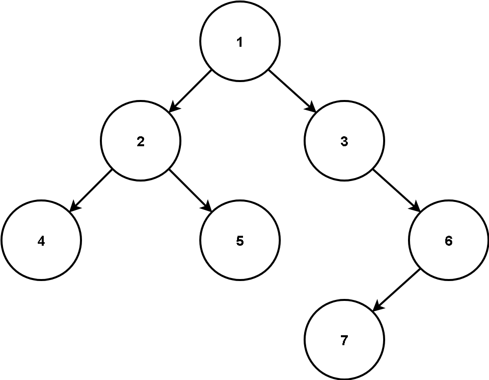
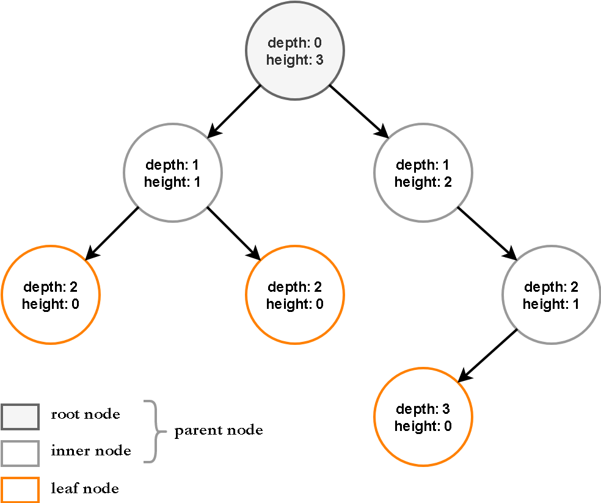

# Rooted Tree

## Learning Goals

- Design and implement a software solution that incorporates  the Composite Pattern.


## Description

The diagram below is called a (rooted) **tree**. It is a mathematical structure for representing relationships: it consists of a set of **nodes** (or vertices) connected by **edges** (or arcs).



Consider the following definitions:

* The **depth** of a node is the number of edges from the node to the tree's *root* node. A root node will have a depth of 0.

* The **height** of a node is the number of edges on the longest path from the node to a *leaf*. A leaf node will have a height of 0.




You are given a partially implemented program which allows one to represent a rooted tree and print out depth and height of each node along with its value (data stored in a node).

For instance, to represent the tree above, we have the following code segment in the `main` method:

```java
Parent root = new Parent(1);
Parent l2 = new Parent(2);
root.addChild(l2);
Parent r3 = new Parent(3);
root.addChild(r3);
Leaf l4 = new Leaf(4);
l2.addChild(l4);
Leaf r5 = new Leaf(5);
l2.addChild(r5);
Parent r6 = new Parent(6);
r3.addChild(r6);
Leaf l7 = new Leaf(7);
r6.addChild(l7);
```

Upon printing the tree data (by executing `root.print()`) we shall get the following output (pay attention to indentations)

```plain
Node: 1 - Height: 3 - Depth: 0
    Node: 2 - Height: 1 - Depth: 1
        Node: 4 - Height: 0 - Depth: 2
        Node: 5 - Height: 0 - Depth: 2
    Node: 3 - Height: 2 - Depth: 1
        Node: 6 - Height: 1 - Depth: 2
            Node: 7 - Height: 0 - Depth: 3
```


By invoking print on `r3`, that is by executing `r3.print()`, we take `r3` to be the root of our tree. The program shall only print node properties of `r3` and all its *children* (note the values of `Depth` has changed)

```plain
Node: 3 - Height: 2 - Depth: 0
    Node: 6 - Height: 1 - Depth: 1
        Node: 7 - Height: 0 - Depth: 2
```

## Task

Your task is to complete the implementation of classes in the `model` package. 

* You are expected to apply and implement the Composite Design pattern for solving this assignment. 
* Do not make any changes to the `Printer` class. You must use the methods in `Printer` to print information about each node. 
* Do not make any changes to the `ui.Main` class. Once you successfully implemented the classes in `model` package, you can run the `main` method and get the outputs presented above.

You must also write unit tests to get full coverage for all the classes in the `model` package. A sample unit test is provided: `TestNode.java` 


## Submission

When you are confident that you have a correct solution, you should  submit to AutoTest by entering the following comment on your commit: 

```
@autobot #d9
```

When you submit, AutoTest will run our tests and yours. Remember that your grade is based on the degree to which your tests cover your implementation of the classes in `model` package (20%) and the number of our tests that pass (80%).  For this assignment, you will have to wait 4 hours between successive requests for feedback from AutoTest. 